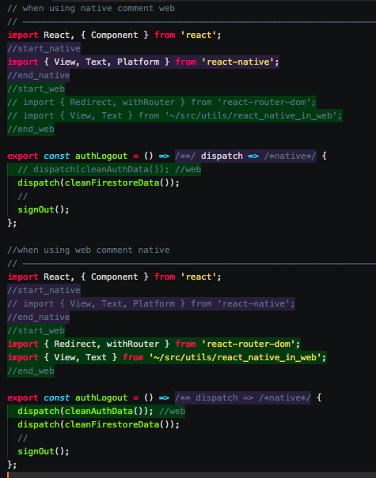

# react-nat-web-differentiator

It is practical to have the code of react-native and react-web in a single file, but in order to be able to reuse it in a practical way it is necessary to have well differentiated which parts of the code are unique to the platform and which are shared.

That's why I created react-nat-web-differentiator.

When using the file for web, it is easy to comment on the native part that is colored and vice versa

## Usage



```javascript

// when using native comment web
// ────────────────────────────────────────────────────────────────────────────────

import React, { Component } from 'react';
//start_native
import { View, Text, Platform } from 'react-native';
//end_native
//start_web
// import { Redirect, withRouter } from 'react-router-dom';
// import { View, Text } from '~/src/utils/react_native_in_web';
//end_web

export const authLogout = () => /**/ dispatch => /*native*/ {
	// dispatch(cleanAuthData()); //web
	dispatch(cleanFirestoreData());
	//
	signOut();
};

//when using web comment native
// ────────────────────────────────────────────────────────────────────────────────

import React, { Component } from 'react';
//start_native
// import { View, Text, Platform } from 'react-native';
//end_native
//start_web
import { Redirect, withRouter } from 'react-router-dom';
import { View, Text } from '~/src/utils/react_native_in_web';
//end_web

export const authLogout = () => /** dispatch => /*native*/ {
	dispatch(cleanAuthData()); //web
	dispatch(cleanFirestoreData());
	//
	signOut();
};

```

## Custom colors (optional)
 - Add in package.json & use your own colors

```javascript
//these are the default colors
{
	...
	"dependencies": {...},
	"react_nat_web_differentiator": {
		"web": "rgba(0, 205, 30, .25)",
		"native": "rgba(134, 91, 217, .25)"
	}
}
```


## License

MIT.

## Author

Nicolas Sturm -- sturmenta
